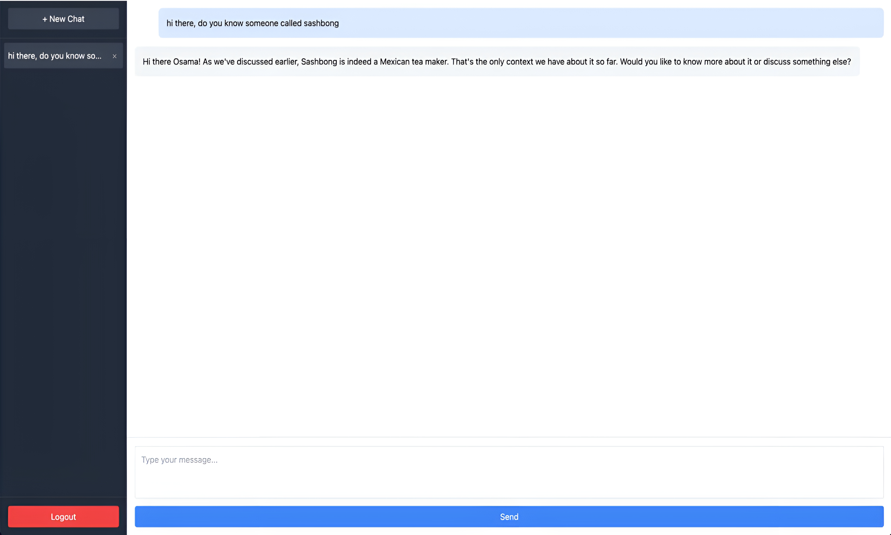

# MemoDoc AI (RAG)

An intelligent AI assistant that learns from both your documents and past conversations to provide context-aware, accurate, and personalized responses.

## Overview



MemoDoc AI is a chat application that allows users to interact with an AI assistant leveraging both your provided documents and the history of your interactions. By integrating state-of-the-art language models with document retrieval and conversation memory, MemoDoc AI ensures that responses are highly relevant, context-specific, and tailored to your unique needs.

## Features

- **User Authentication**: Secure signup and login system using JWT tokens.
- **Chat Interface**: Interactive chat interface for seamless communication with the AI assistant.
- **Conversation Memory**: The AI assistant references past conversations to maintain context and continuity.
- **Document Management**: Automatically load, hash, and monitor documents in the `docs` directory for changes.
- **Retrieval-Augmented Generation (RAG)**: Combines document retrieval with language generation to provide accurate answers based on your documents.
- **Embeddings with Ollama**: Utilizes Ollama Embeddings for vector representation of documents.
- **Vector Store with Chroma**: Efficient storage and retrieval of document embeddings using Chroma.
- **LangChain Integration**: Leverages LangChain for prompt management and chain execution.
- **FastAPI Backend**: Robust and scalable backend built with FastAPI.

## Getting Started

### Prerequisites

- **Python 3.7+**
- **Ollama**: Installed and running locally
- **Chroma**: Installed for vector storage
- **llama3**: Pulled with ollama which is the chat model 
- **nomic-embed-text**: Pulled with ollama which is the embedding model

### Installation

1. **Clone the Repository**

   ```bash
   git clone https://github.com/Osama-Yusuf/MemoDoc-AI-RAG.git
   cd MemoDoc-AI-RAG
   ```

2. **Create a Virtual Environment**

   ```bash
   python -m venv venv
   source venv/bin/activate  # On Windows use `venv\Scripts\activate`
   ```

3. **Install Dependencies**

   ```bash
   pip install -r requirements.txt
   ```

4. **Initialize the Database**

   ```bash
   python app.py
   ```

   This will create the SQLite database `chat_app.db`.

5. **Start the Ollama Server**

   Ensure that the Ollama server is running and accessible at `http://127.0.0.1:11434`.

6. **Run the Application**

   ```bash
   uvicorn app:app --reload
   ```

   The API will be accessible at `http://localhost:8000`.

7. **Open the Frontend**

   Open `index.html` in your preferred browser, or run:

   ```bash
   python -m http.server 8080
   ```

### Usage

- **Signup**: Create a new account using the signup form.
- **Login**: Access your account using your credentials.
- **Chat**: Start a conversation with the AI assistant.
- **Document Updates**: Place your documents in the `docs` directory. The system will automatically detect changes and update the vector store.

## Project Structure

- **app.py**: Main FastAPI application containing all backend logic.
- **index.html**: Frontend interface for user interaction.
- **docs**: Directory where all documents for RAG are stored.
- **chat_app.db**: SQLite database file for storing user and message data.

## Detailed Explanation

### Backend Components

#### FastAPI Application

The backend is built using FastAPI, providing a robust and high-performance web framework.

- **Authentication Routes**: `/signup` and `/token` for user registration and JWT token generation.
- **Chat Route**: `/chat` endpoint handles user messages and generates responses using the AI assistant.
- **Document Update Route**: `/update-docs` checks for changes in the documents and updates the vector store.

#### User Authentication

- Uses JWT tokens for secure authentication.
- Passwords are hashed using bcrypt via PassLib.

#### Database Models

- **User**: Stores user information such as username, email, and hashed password.
- **Message**: Stores chat messages associated with users.

#### Document Manager

- **Document Loading**: Loads documents from the `docs` directory.
- **Hashing**: Computes MD5 hashes of files to detect changes.
- **Vector Store Update**: Updates the Chroma vector store when changes are detected.
- **Embeddings**: Uses OllamaEmbeddings to convert documents into vector representations.

#### AI Assistant

- **Model**: Utilizes `ChatOllama` as the language model for generating responses.
- **Prompt Template**: Uses a structured prompt to provide context and instructions to the AI assistant.
- **Conversation Memory**: Incorporates past user interactions to maintain context across turns.
- **Chain Execution**: Employs LangChain's chain functionality to process inputs and generate outputs.

### Frontend Components

#### Authentication Forms

- **Login and Signup Forms**: Allow users to authenticate and create accounts.
- **Form Validation**: Ensures that users provide necessary information.

#### Chat Interface

- **Messages Container**: Displays the conversation between the user and the AI assistant.
- **Message Input**: Allows users to type and send messages.
- **Conversations List**: Sidebar displaying all user conversations.
- **New Chat**: Option to start a new conversation.
- **Delete Conversation**: Ability to delete existing conversations.
- **Logout**: Option to logout from the account.

### Technologies Used

- **FastAPI**: Backend framework.
- **SQLAlchemy**: ORM for database interactions.
- **PassLib**: Password hashing.
- **JWT (PyJWT)**: JSON Web Tokens for authentication.
- **LangChain**: Prompt management and chain execution.
- **Ollama Embeddings**: For document embeddings.
- **Chroma**: Vector store for embeddings.
- **Tailwind CSS**: Styling for the frontend.
- **JavaScript**: For frontend interactivity.

## Future Enhancements

- **Dockerization**: Containerize the application for easier deployment.
- **Scalability**: Implement a more scalable database like PostgreSQL.
- **Model Improvements**: Integrate more advanced language models.
- **UI/UX Enhancements**: Improve the frontend interface and user experience.
- **File Uploads**: Allow users to upload documents via the frontend.
- **Multi-User Document Management**: Separate documents per user.

## Troubleshooting

- **Database Errors**: Ensure the database is initialized and accessible.
- **Ollama Server Issues**: Verify that the Ollama server is running and accessible at the specified URL.
- **CORS Errors**: Ensure that the frontend and backend are served from the correct origins.

## Contributing

Contributions are welcome! Please open an issue or submit a pull request.

## License

This project is licensed under the MIT License.
